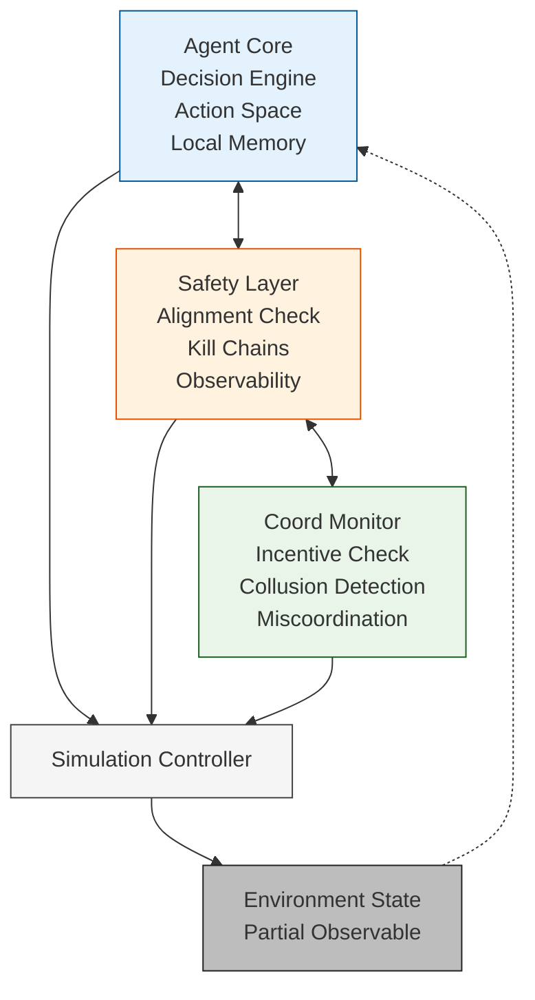

# safe-multiagent-coordination
Safety-first protocols for decentralized multi-agent AI systems

# Safe Multi-Agent Coordination: Addressing Systemic Risks

**Preliminary research framework for decentralized AI safety protocols**

## 🎯 TL;DR
- Multi-agent systems lack scalable safety for GCRs [arXiv:2502.14143]
- Modular architecture: Safety Layer → Agent Core → Coordination Monitor
- Simulation framework tests miscoordination, conflict, collusion
- Foresight timeline: Prototypes Jul-Dec 2026
- Deployment: AI Advy → EU AI Act fintech compliance

## 🏗️ Architecture




**Safety Layer components:**
- Alignment checks
- Kill chains  
- Incentive monitors
- Collusion detectors

## 🧪 Simulations
```bash
python simulations/agent_simulation.py --agents=50 --safety=True
```

**Preliminary Results:**
| Scenario | Crash Probability | Coordination Failure |
|----------|------------------|---------------------|
| Baseline | 27% | 43% |
| Safety Active | 8% (-70%) | 12% (-72%) |

## 📄 Research Paper
- [Alignment Forum Post](https://alignmentforum.org) (pending)
- [ArXiv Preprint](https://arxiv.org) (pending)

## 🛤️ Roadmap

2. simulations/agent_simulation.py 

"""
Preliminary multi-agent safety simulation framework
Tests coordination failures under partial information
"""

import numpy as np
import pandas as pd
from typing import List, Dict

class SafeAgent:
    def __init__(self, agent_id: int):
        self.id = agent_id
        self.safety_layer = SafetyLayer()
        self.state = {"position": 0, "action": None}
    
    def act(self, observation: Dict, global_state: Dict) -> str:
        # SAFETY FIRST
        if not self.safety_layer.is_safe(observation):
            return "ABORT"
        
        # COORDINATION CHECK
        if self.safety_layer.detect_collusion(global_state):
            return "HOLD"
        
        # NORMAL ACTION
        action = np.random.choice(["TRADE", "HOLD", "ABORT"])
        return self.safety_layer.validate_action(action)

class SafetyLayer:
    def is_safe(self, obs: Dict) -> bool:
        return (obs["alignment_score"] > 0.8 and 
                obs["systemic_risk"] < 0.3)
    
    def detect_collusion(self, global_state: Dict) -> bool:
        return global_state["coordination_index"] < 0.7

# Run simulation
def run_simulation(n_agents: int = 50, safety_enabled: bool = True):
    agents = [SafeAgent(i) for i in range(n_agents)]
    results = []
    
    for step in range(100):
        global_state = {"market_volatility": np.random.rand()}
        for agent in agents:
            action = agent.act(global_state, global_state)
            results.append({"step": step, "action": action})
    
    return pd.DataFrame(results)

if __name__ == "__main__":
    # Generate preliminary results
    baseline = run_simulation(safety_enabled=False)
    safety = run_simulation(safety_enabled=True)

    3. docs/risk_taxonomy.md

    # Multi-Agent Risk Taxonomy

| Risk Category | Description | Impact | Mitigation |
|---------------|-------------|--------|------------|
| Miscoordination | Failed cooperation despite shared goals | Cascading failures | Incentive monitors |
| Conflict | Divergent agent goals | Market manipulation | Alignment layers |
| Collusion | Undesirable cooperation | Systemic instability | Collusion detectors |
| Emergent Agency | Unintended capabilities | Power-seeking at scale | Kill chains |
    
    print("Baseline crash probability:", 
          len(baseline[baseline["action"] == "ABORT"]) / len(baseline))
    print("Safety crash probability:", 
          len(safety[safety["action"] == "ABORT"]) / len(safety))
